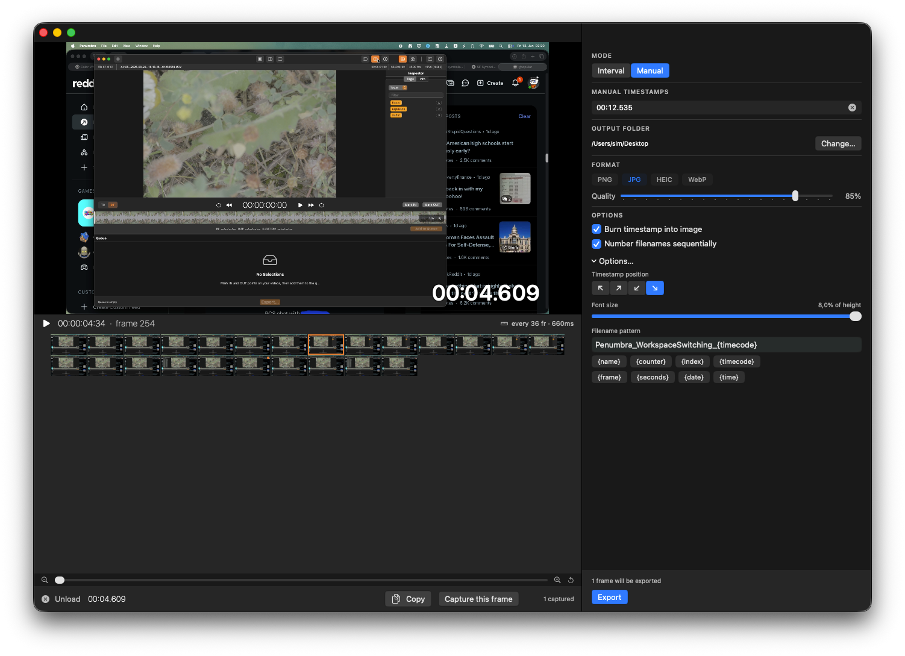
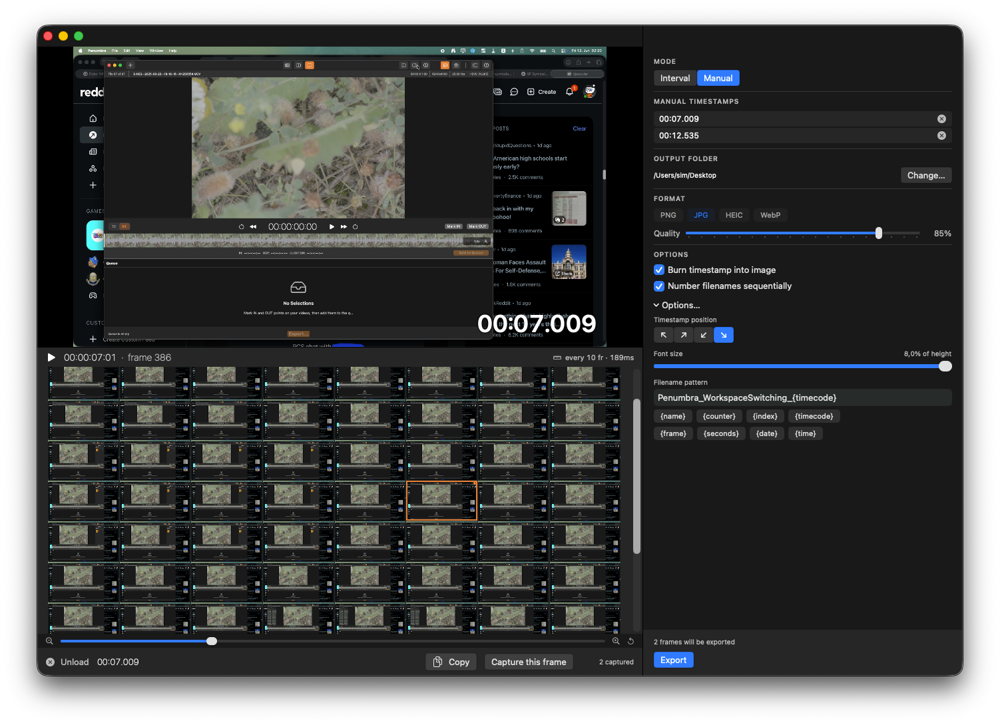

#  Stills From Video

A macOS app that extracts frames from a video as images — every Nth frame, every N seconds, or hand-picked timestamps — with an optional burned-in timestamp and chronological filename numbering.


[](https://github.com/Xpycode/ScreenshotFromVideos/releases/latest)


## Why

Claude Code (and most LLMs) can't read video. When you want to show what's happening in a screen recording, you need stills. This app turns a clip into a folder of frames — timestamped and numbered in order — ready to drop straight into a prompt.

## Screenshots


*Manual mode — scrub the strip, hit Capture this frame to queue exact timestamps. The live timestamp burn-in previews over the player, pinned to the real video rect.*


*Queue as many frames as you like — the zoomable thumbnail strip walks the whole clip, the footer shows how many frames will export.*

## Features

- **Two extraction modes** — *Interval* (every Nth frame or every N seconds) or *Manual* (pick exact timestamps)
- **Thumbnail strip scrubber** — scrub the whole clip, zoom the strip in and out, capture the frame under the playhead
- **Capture or copy** — `Capture this frame` queues a still; `Copy` puts the current full-res frame on the clipboard
- **Burn timestamp into image** — optional timecode overlay with four corner positions and adjustable font size
- **Live burn-in preview** — see the timestamp on the player, anchored to the actual letterboxed video, before you export
- **Sequential numbering** — number filenames chronologically so they sort correctly in Finder
- **Flexible filename patterns** — tap-to-insert tokens: `{name}` `{counter}` `{index}` `{timecode}` `{frame}` `{seconds}` `{date}` `{time}`
- **Multiple export formats** — PNG, JPG, HEIC, and WebP with a quality slider (plus WebP lossless)
- **Frame-count preview** — the footer tells you exactly how many frames will be written before you commit
- **Drag & drop or file picker** — drop a video on the window or browse for it
- **Show in Finder** — jump straight to the exported folder
- **Auto-Update** — check for new versions from the app menu (Sparkle)

## Installation

1. Download `StillsFromVideo.dmg` from [Releases](https://github.com/Xpycode/ScreenshotFromVideos/releases/latest)
2. Open the DMG and drag **Stills From Video** to Applications
3. Launch from the Applications folder

## Usage

1. **Load** — Drop a video onto the window or click to browse
2. **Choose a mode** — *Interval* for evenly-spaced frames, or *Manual* to pick exact moments
3. **Scrub & capture** — Drag the strip to find a frame, then `Capture this frame` (or press `Q`)
4. **Configure** — Set format and quality, timestamp burn-in, numbering, and filename pattern
5. **Export** — Click Export to write the frames to your output folder

### Modes

| Mode | What it does |
|------|--------------|
| **Interval** | Extracts a frame every *N* frames or every *N* seconds across the whole clip |
| **Manual** | Captures only the timestamps you pick by scrubbing and capturing |

### Filename Tokens

Build any naming scheme by tapping these chips under the pattern field:

| Token | Expands to |
|-------|------------|
| `{name}` | Source video filename |
| `{counter}` | Sequential counter (1, 2, 3…) |
| `{index}` | Frame index in the export set |
| `{timecode}` | Timestamp, e.g. `00-07-009` |
| `{frame}` | Zero-padded frame number |
| `{seconds}` | Time in seconds |
| `{date}` | Export date |
| `{time}` | Export time |

### Keyboard Shortcuts

| Shortcut | Action |
|----------|--------|
| `Q` / `M` | Capture the current frame into the export queue |
| `←` `→` | Step the strip one frame |
| `↑` `↓` | Jump a full row in the strip |
| `⌘C` | Copy the current frame to the clipboard |

## Building from Source

Requires Xcode 16+, macOS 15.0+, and [xcodegen](https://github.com/yonaskolb/XcodeGen) (`brew install xcodegen`).

```bash
git clone https://github.com/Xpycode/ScreenshotFromVideos.git
cd ScreenshotFromVideos/01_Project
xcodegen generate
xcodebuild -scheme ScreenshotFromVideos -configuration Release
```

The `.xcodeproj` is generated — edit `project.yml`, not the pbxproj.

## License

MIT
